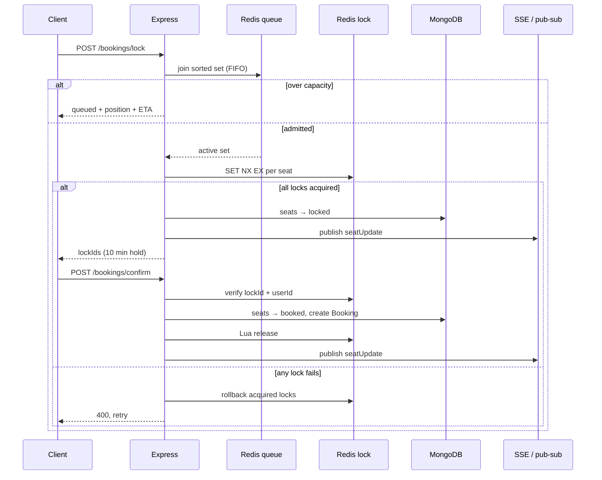

# TicketHub

Full-stack ticketing system that treats **double-booking, flash-sale traffic, and live seat state** as first-class problems — the same constraints Ticketmaster has to get right.

TypeScript · Express · MongoDB · Redis · BullMQ · React · SSE · Jest

---

## Why this exists

Seat inventory is a shared mutable resource. Two users clicking the same seat, a hold that expires mid-checkout, and a surge that saturates the booking path are not edge cases — they are the product.

This repo is a working answer to those constraints: **atomic distributed locks**, a **Redis-backed waiting room**, **cross-instance live updates**, and **background reconciliation** between Redis and MongoDB.

## What a reviewer should look at

| Hard problem | Implementation | Signal |
|---|---|---|
| Two users cannot hold the same seat | Redis `SET key value EX ttl NX` | Atomic acquire; no check-then-set race |
| A user cannot release someone else's lock | Lua compare-and-delete on `lockId` | Ownership-safe unlock |
| Partial multi-seat hold | Acquire-all-or-rollback | No stranded locks |
| Flash-sale stampede | Redis sorted-set FIFO + concurrency cap (10 / event) | Admission control in front of booking |
| Only one instance advances a queue | `SET NX` processing lock | Safe if you run more than one API process |
| Seat map stays live across servers | Redis pub/sub → SSE fanout | Clients on instance B see locks from instance A |
| Redis TTL and Mongo status can drift | BullMQ job every minute | Expired holds return to inventory |
| Hot catalog reads | Cache-aside + pattern invalidation | Lists/details cached; search stays uncached |

Core paths: [`lock.service.ts`](backend/src/services/lock.service.ts) · [`booking.service.ts`](backend/src/services/booking.service.ts) · [`queue.service.ts`](backend/src/services/queue.service.ts) · [`sse.service.ts`](backend/src/services/sse.service.ts) · [`job.service.ts`](backend/src/services/job.service.ts)

---

## Booking flow



Seat state machine: `available → locked → booked`. Holds expire after `LOCK_TTL_SECONDS` (default 600). Confirm verifies the caller still owns each `lockId` before writing the booking.
---

## Tests

Jest + `ts-jest` · in-memory MongoDB · Supertest · Redis and BullMQ mocked.

20 test files across **models, services, routes, and middleware**. 

```bash
cd backend && npm test
```

---

## Stack

| Layer | Choice |
|---|---|
| API | Node.js, Express, TypeScript |
| Data | MongoDB, Mongoose (compound + unique indexes) |
| Coordination | Redis / ioredis (locks, cache, sorted sets, pub/sub) |
| Jobs | BullMQ (repeatable lock cleanup) |
| Auth | JWT + bcrypt |
| Client | React 18, TypeScript, Vite, React Router, Zustand, EventSource |
| Tests | Jest, Supertest, mongodb-memory-server |

---

## Screenshots


Client: interactive seat map with live SSE status (`available` / selected / locked by others / booked), waiting-room modal with position, 10-minute checkout hold, JWT session via Zustand.

---

## Run locally

Needs Node.js 18+, MongoDB, and Redis.

```bash
# API
cd backend
npm install
cp .env.example .env   # MONGODB_URI, REDIS_URI, JWT_SECRET
npm run seed           # venues, performers, events, seats + test user
npm run dev            # http://localhost:5000

# Client (second terminal)
cd frontend
npm install
npm run dev            # http://localhost:5173
```

Seeded login: `test@example.com` / `password123`

Seat colors: green available · blue selected · yellow locked · gray booked.

---

## API

| Method | Path | Auth | Purpose |
|---|---|---|---|
| `GET` | `/health` | | Liveness |
| `POST` | `/api/auth/register`, `/login` | | JWT |
| `GET` | `/api/events` | | Paginated catalog, category, search |
| `GET` | `/api/events/:id/seats` | | Seat map |
| `GET` | `/api/sse/events/:eventId/seats` | | SSE seat stream |
| `POST` | `/api/bookings/lock` | JWT | Queue + hold seats |
| `GET` | `/api/bookings/queue/:eventId` | JWT | Position / ETA / `canProceed` |
| `POST` | `/api/bookings/confirm` | JWT | Finalize if locks still owned |
| `POST` | `/api/bookings/unlock` | JWT | Release hold |
| `GET` | `/api/bookings/my-bookings` | JWT | Purchase history |

---

## Layout

```
backend/src/
  services/     lock, queue, booking, sse, cache, jobs, redis
  models/       User, Event, Venue, Performer, Seat, Booking
  routes/       auth, events, bookings, sse, queue, venues, performers
  middleware/   JWT auth, error handler
  tests/        models / services / routes / middleware
frontend/src/
  pages/        catalog, event, seats, checkout, tickets, login
  hooks/        useSSE, useAuth
  store/        Zustand auth
```
